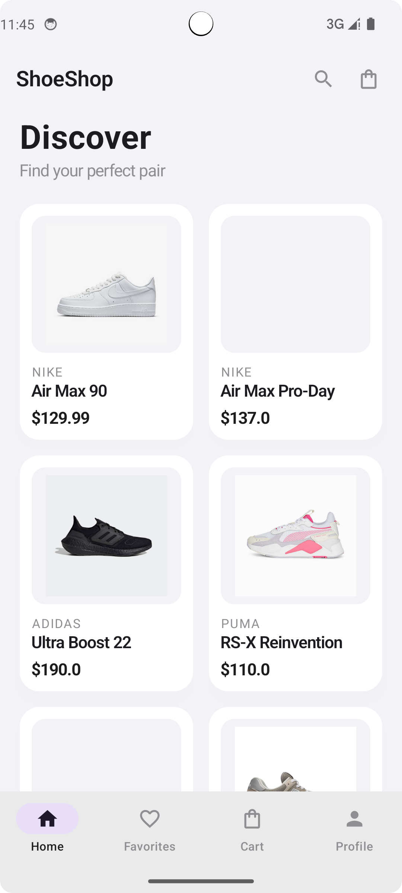
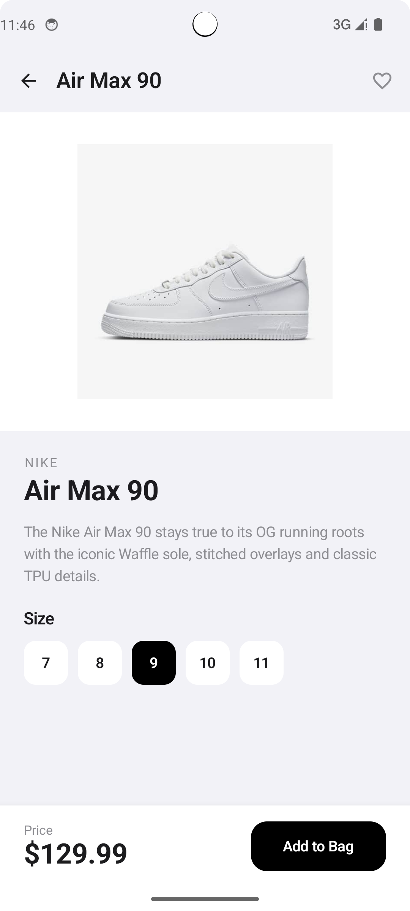
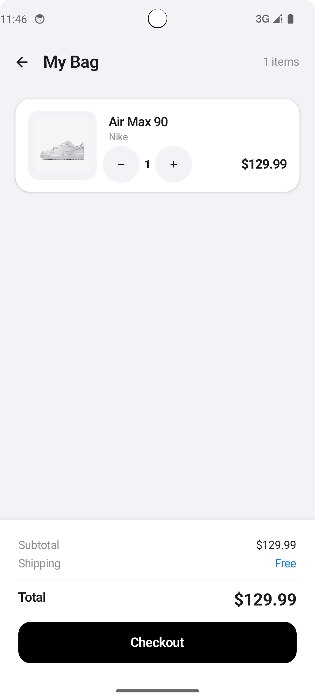
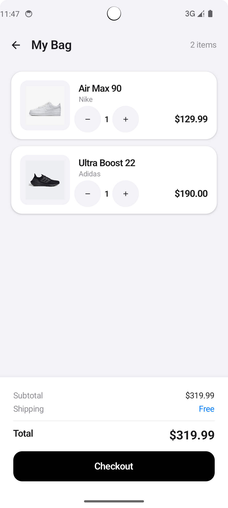

# ShoeShop - Kotlin Jetpack Compose Mobile Shopping App

## GitHub Repository
https://github.com/realzhengyuting-cloud/ShoeShop

## Project Overview
A mobile shopping application built with Kotlin Jetpack Compose that allows users to browse shoes, view details, and manage a shopping cart. This project demonstrates modern Android development (MAD) practices including ViewModel, StateFlow, Type-Safe Navigation, and Material Design 3.

## How to Configure and Run

### Prerequisites
- Android Studio Hedgehog (2023.1.1) or later
- JDK 17
- Android SDK 34

### Steps to Run
1. Clone the repository: `git clone https://github.com/realzhengyuting-cloud/ShoeShop.git`
2. Open Android Studio
3. Select "Open an existing project" and choose the `ShoeShop` folder
4. Wait for Gradle sync to complete
5. Connect an Android device or start an emulator (API 26+)
6. Click the "Run" button (green play icon) or press `Shift+F10`

### Build Configuration
| Component | Version |
|-----------|---------|
| Kotlin Plugin | 1.9.24 |
| Compose Compiler | 1.5.14 |
| Navigation Compose | 2.8.5 |
| Lifecycle Runtime Compose | 2.7.0 |

## Project Structure

```
ShoeShop/
├── app/
│   ├── build.gradle.kts          # App-level build config with Compose dependencies
│   └── src/main/
│       ├── AndroidManifest.xml    # App manifest
│       ├── java/com/example/shoeshop/
│       │   ├── MainActivity.kt           # Entry point, NavHost & Type-Safe Navigation
│       │   ├── model/
│       │   │   ├── Shoe.kt              # Shoe data class
│       │   │   └── CartItem.kt          # Cart item data class
│       │   ├── data/
│       │   │   └── ShoeData.kt          # Static shoe list
│       │   ├── navigation/
│       │   │   └── Routes.kt            # @Serializable route definitions (Type-Safe)
│       │   ├── viewmodel/
│       │   │   └── CartViewModel.kt     # ViewModel with MutableStateFlow/StateFlow
│       │   └── ui/
│       │       ├── theme/
│       │       │   ├── Color.kt         # App color definitions
│       │       │   └── Theme.kt         # Material3 theme setup
│       │       ├── components/
│       │       │   └── ShoeCard.kt      # Stateless reusable shoe card component
│       │       └── screens/
│       │           ├── HomeScreen.kt    # M3 Scaffold + TopAppBar + NavigationBar
│       │           ├── DetailScreen.kt  # M3 Scaffold + TopAppBar + detail view
│       │           └── CartScreen.kt    # M3 Scaffold + TopAppBar + cart management
│       └── res/
│           └── values/
│               ├── strings.xml
│               └── themes.xml
├── build.gradle.kts              # Root build config (Kotlin 1.9.24, Serialization plugin)
├── settings.gradle.kts           # Project settings
└── gradle/wrapper/
    └── gradle-wrapper.properties # Gradle version config
```

## Architecture & Key Technologies

### 1. ViewModel + StateFlow (State Management)
- Cart state managed in `CartViewModel` using `MutableStateFlow`
- UI observes state via `collectAsStateWithLifecycle()` (lifecycle-aware, recommended approach)
- Data survives screen rotation (configuration changes)

### 2. Type-Safe Navigation (Gold Standard)
- Routes defined as `@Serializable` objects/data classes (`HomeRoute`, `DetailRoute(shoeId)`, `CartRoute`)
- Navigation uses object passing: `navController.navigate(DetailRoute(shoeId = shoe.id))`
- No string-based routing anywhere in the codebase

### 3. Material Design 3
- All screens use `Scaffold` with `TopAppBar`
- Home screen includes `NavigationBar` (bottom navigation)
- Uses `MaterialTheme.colorScheme` and `MaterialTheme.typography` throughout

### 4. State Hoisting & UDF (Unidirectional Data Flow)
- `ShoeCard` is a stateless composable (receives data + lambda callbacks only)
- Events flow up (onClick), state flows down (shoe data)

## Features
- **Home Screen**: Displays shoes in a 2-column grid with M3 TopAppBar, search icon, cart badge, and bottom NavigationBar
- **Detail Screen**: Shows full product details with size selection and "Add to Bag" button
- **Cart Screen**: Lists selected items with quantity controls (+/-), subtotal/total calculation, and checkout button

## Screenshots

### Home Screen


### Detail Screen


### Shopping Cart


### Cart with Items

