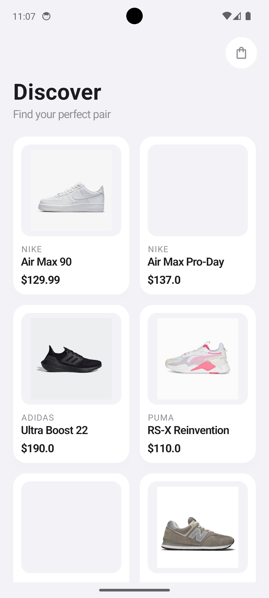
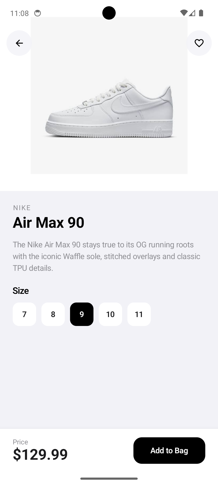
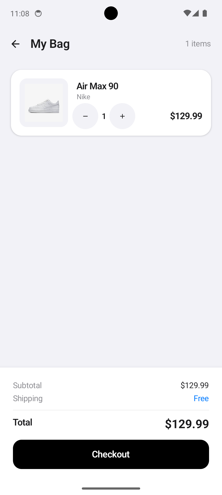
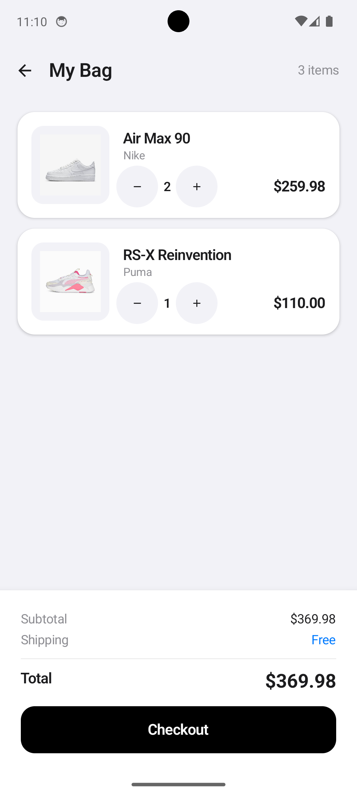

# ShoeShop - Kotlin Jetpack Compose Mobile Shopping App

## Project Overview
A mobile shopping application built with Kotlin Jetpack Compose that allows users to browse shoes, view details, and manage a shopping cart.

## How to Configure and Run

### Prerequisites
- Android Studio Hedgehog (2023.1.1) or later
- JDK 17
- Android SDK 34

### Steps to Run
1. Open Android Studio
2. Select "Open an existing project" and choose the `ShoeShop` folder
3. Wait for Gradle sync to complete
4. Connect an Android device or start an emulator (API 26+)
5. Click the "Run" button (green play icon) or press `Shift+F10`

## Project Structure

```
ShoeShop/
├── app/
│   ├── build.gradle.kts          # App-level build config with Compose dependencies
│   └── src/main/
│       ├── AndroidManifest.xml    # App manifest
│       ├── java/com/example/shoeshop/
│       │   ├── MainActivity.kt           # Entry point & navigation logic
│       │   ├── model/
│       │   │   ├── Shoe.kt              # Shoe data class
│       │   │   └── CartItem.kt          # Cart item data class
│       │   ├── data/
│       │   │   └── ShoeData.kt          # Static shoe list (no database needed)
│       │   └── ui/
│       │       ├── theme/
│       │       │   ├── Color.kt         # App color definitions
│       │       │   └── Theme.kt         # Material3 theme setup
│       │       ├── components/
│       │       │   └── ShoeCard.kt      # Reusable shoe card component
│       │       └── screens/
│       │           ├── HomeScreen.kt    # Product grid listing
│       │           ├── DetailScreen.kt  # Product detail & add to cart
│       │           └── CartScreen.kt    # Shopping bag with total
│       └── res/
│           └── values/
│               ├── strings.xml
│               └── themes.xml
├── build.gradle.kts              # Root build config
├── settings.gradle.kts           # Project settings
└── gradle/wrapper/
    └── gradle-wrapper.properties # Gradle version config
```

## Features
- **Home Screen**: Displays shoes in a 2-column grid with images, brand, name, and price
- **Detail Screen**: Shows full product details with "Add to Cart" button
- **Cart Screen**: Lists selected items with quantity controls (+/-), remove button, and total price calculation

## Screenshots

### Home Screen


### Detail Screen


### Shopping Cart (Single Item)


### Shopping Cart (Multiple Items)


## Technologies Used
- Kotlin
- Jetpack Compose (Material3)
- Coil (image loading)
- State management with Compose remember/mutableStateOf
